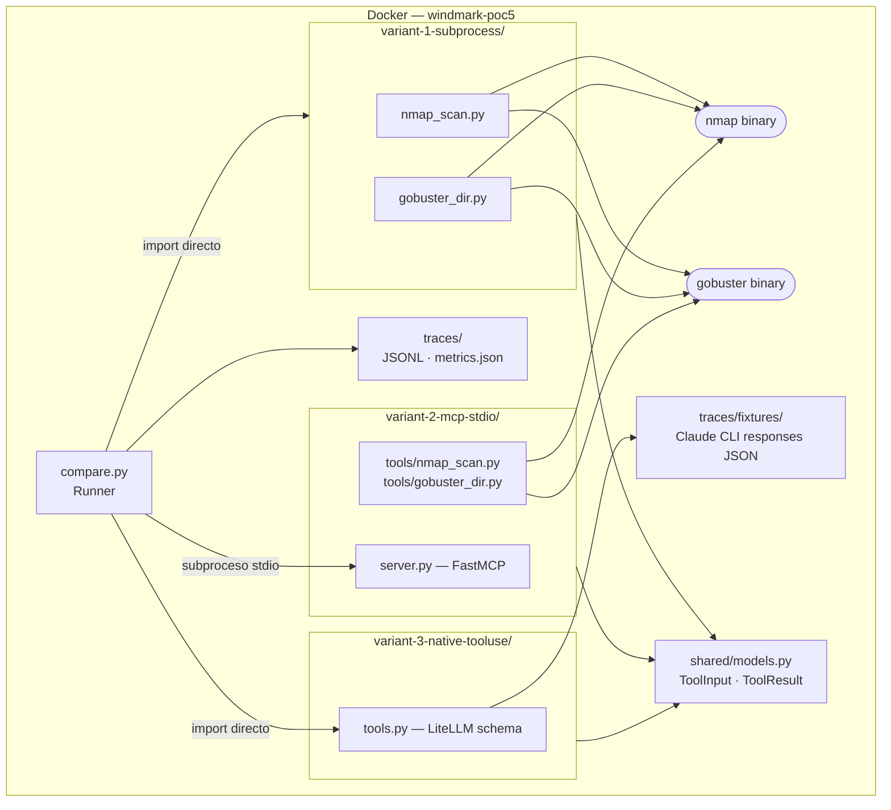
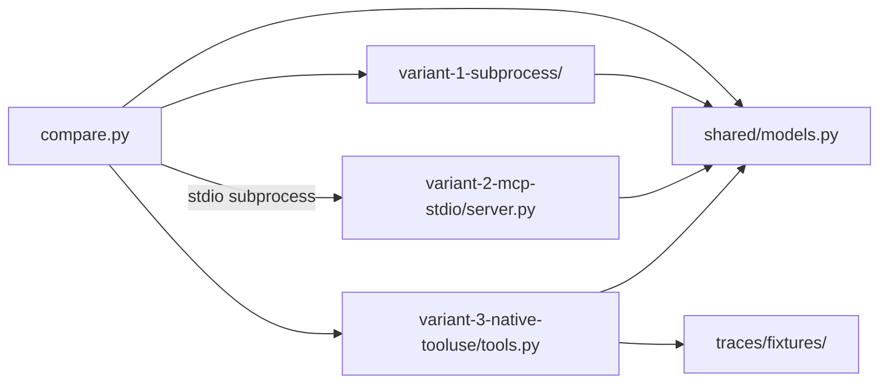
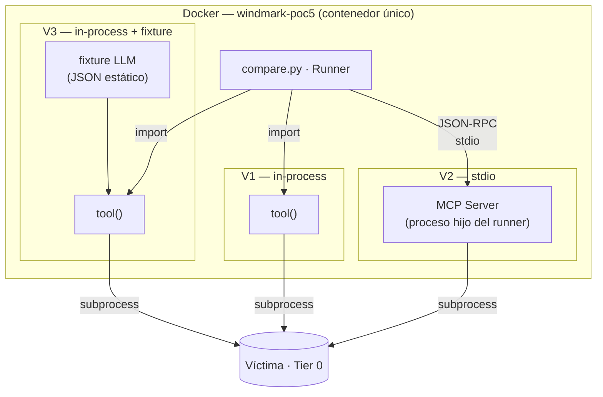
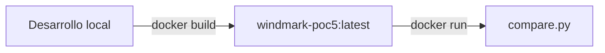

# Tech Spec — PoC #5: Contrato de invocación de tools

> [!abstract] Metadata
> | | |
> |---|---|
> | **Status** | 🟡 Draft |
> | **Owner** | Carlos Granden |
> | **Created** | 2026-05-15 |
> | **Updated** | 2026-05-15 |
> | **Version** | v0.1 |
> | **ProductSpec** | [[product-spec]] |

---

## 📌 Scope

Este documento responde al cómo técnico de la PoC #5. El qué y el porqué están en [[product-spec]]. Cubre: stack con versiones, topología de módulos, contrato de datos compartido entre variantes, estrategia de fixtures para el LLM mockeado, setup de Docker y los ADRs propios de esta PoC. No cubre el ADR-003 del MVP (ese es el output de la PoC, no un input).

---

## 🧱 Tech Stack

| Componente | Tecnología | Versión | Rationale |
|---|---|---|---|
| Lenguaje | Python | 3.12 | Hereda del MVP (KB tech-spec). Type hints completos, `match`, alineado con runtime del MVP |
| Package manager | uv | *TBD* | Hereda del MVP. Lockfile reproducible, `uv sync` como único comando de setup |
| Validación y schemas | Pydantic | v2.x | Genera `model_json_schema()` para V1; define `ToolResult` compartido; contratos in/out de tools |
| MCP server (V2) | fastmcp | *TBD* | Decoradores `@mcp.tool()` reducen el boilerplate del SDK oficial. Suficiente para un servidor de PoC |
| Abstracción LLM (V3) | LiteLLM | *TBD* | Hereda del MVP. En esta PoC solo se usa para definir el schema en formato OpenAI `tools[]`; el LLM está mockeado con fixtures |
| Logging | structlog | *TBD* | JSONL estructurado por invocación; mismo approach que el MVP |
| Containerización | Docker | v2.x | Imagen Debian/Kali con Python 3.12 + uv + nmap + gobuster. Sin Compose para esta PoC |

> [!tip] Runtime directo
> `pydantic` · `fastmcp` · `litellm` · `structlog`

---

## 🏗️ Module Design

### Topología de ejecución



### Grafo de módulos



### Módulos

#### `compare.py` — Runner de comparación

Punto de entrada del experimento. Invoca V1 y V3 como imports directos y V2 arrancando el proceso FastMCP por stdio. Recoge un `ToolResult` por invocación, lo serializa a JSONL y consolida `traces/metrics.json` al terminar. No contiene lógica de tools.

#### `shared/models.py` — Contrato de datos compartido

Define `ToolInput` y `ToolResult` como modelos Pydantic. Las tres variantes y el runner los importan. Garantiza que la comparación entre variantes sea sobre datos estructuralmente idénticos.

#### `variant-1-subprocess/nmap_scan.py` y `gobuster_dir.py` — Variante subprocess+Pydantic

Función pura por tool. Acepta un `ToolInput`, invoca el binario con `subprocess.run()`, parsea el output y devuelve un `ToolResult`. El JSON schema para tool-use del LLM se genera con `ToolInput.model_json_schema()`.

#### `variant-2-mcp-stdio/server.py` — Variante MCP server stdio

Servidor FastMCP que expone `nmap_scan` y `gobuster_dir` como MCP tools con `@mcp.tool()`. Arrancado por el runner como subproceso; el runner actúa como cliente MCP. La comunicación es stdio.

#### `variant-2-mcp-stdio/tools/` — Implementaciones de tools para MCP

Las mismas dos tools de V1, adaptadas como callables que el servidor FastMCP puede registrar.

#### `variant-3-native-tooluse/tools.py` — Variante tool-use nativo

Define el schema de `nmap_scan` y `gobuster_dir` en formato OpenAI `tools[]` (JSON puro, sin Pydantic). Lee la fixture de Claude CLI para obtener el `tool_use` block simulado, extrae los parámetros y ejecuta el binario directamente. El schema se genera a mano o con `model_json_schema()` + conversión al formato OpenAI.

#### `traces/fixtures/` — Respuestas Claude CLI pregrabadas

JSON con `tool_use` blocks reales de Claude, grabados una vez con `claude` CLI y usados por V3 como mock del LLM. No son generados en tiempo de ejecución del runner.

---

### Contrato de ejecución por variante

Lo que diferencia las tres variantes es **qué proceso llega a la víctima** y **quién decide los parámetros de invocación**.

```
V1 — subprocess + Pydantic (in-process)

  [Agente] ──import──► tool() ──subprocess──► víctima
  └─────────────────── mismo proceso ─────────────────┘

  El propio proceso del agente abre el subprocess y llega a la víctima.


V2 — MCP server stdio (proceso separado)

  [Agente] ──JSON-RPC (stdio)──► [MCP Server] ──subprocess──► víctima
                                 └──── proceso hijo del agente ────────┘

  El MCP Server es un proceso hijo del agente (levantado con Popen).
  Es el Server quien llega a la víctima, no el agente directamente.

  Transporte stdio vs HTTP:
  · stdio  → MCP server es un sidecar del agente. 1 agente = 1 server.
  · HTTP/SSE → MCP server sería un servicio independiente compartible.
  Esta PoC usa stdio.


V3 — Tool-use nativo del provider

  [Agente] ──schema──► [LLM API] ──tool_use block──► [Agente] ──subprocess──► víctima
                        └─ decide cuándo y params ─┘  └───── mismo proceso ──────────┘

  El LLM nunca toca la red: devuelve solo la decisión de invocación.
  El agente ejecuta el subprocess (igual que V1). El LLM API es compartida.

  En esta PoC el LLM está mockeado con fixtures pregrabadas:
  [Agente] ──lee fixture JSON──► params ──subprocess──► víctima
```

| Variante | ¿Quién llega a la víctima? | ¿Quién decide los params? | N agentes → |
|----------|--------------------------|--------------------------|-------------|
| V1 | El agente (in-process) | El agente (caller directo) | N procesos independientes |
| V2 | El MCP Server (proceso hijo) | El agente (cliente MCP) | N servers (1 por agente, stdio) |
| V3 | El agente (in-process) | El LLM (vía tool_use block) | N agentes, 1 LLM API compartida |

### Topología: PoC (contenedor único)

Las tres variantes corren en el mismo contenedor, invocadas por el mismo runner.



> [!important] V2 stdio en multi-agente
> Con transporte stdio, cada agente levanta su propio MCP server como proceso hijo. **N agentes = N MCP servers.** El server no puede compartirse.
> Un MCP server compartido requeriría cambiar el transporte a HTTP/SSE, lo que aumenta la complejidad operativa y queda fuera del scope de esta PoC.

---

## 🔄 Integration Mapping

| Operación interna | Método | Servicio / recurso externo | Notas |
|---|---|---|---|
| Ejecución de nmap (V1) | `subprocess.run(["nmap", ...])` | Binario nmap en PATH | Exit code no-cero capturado en `ToolResult.error` |
| Ejecución de gobuster (V1) | `subprocess.run(["gobuster", ...])` | Binario gobuster en PATH | Requiere wordlist accesible; ruta desde `WORDLIST_PATH` |
| Arranque MCP server (V2) | `subprocess.Popen(["python", "server.py"])` | FastMCP server (proceso hijo) | Timeout configurable con `MCP_SERVER_TIMEOUT`; si no arranca, V2 se marca como error |
| Comunicación con MCP server (V2) | Protocolo MCP por stdin/stdout | FastMCP server stdio | El runner envía `tools/call` JSON-RPC y lee la respuesta |
| Lectura de fixture LLM (V3) | `open(fixtures/<tool>.json)` | `traces/fixtures/` en el contenedor | Fixture ausente → `ToolResult.error`; el runner continúa con V1 y V2 |
| Ejecución de nmap/gobuster (V2 y V3) | Igual que V1, desde dentro del server o V3 | Binarios en PATH del contenedor | Mismos binarios, misma ruta |

> [!warning] Generación de fixtures (operación manual, una sola vez)
> Las fixtures se generan fuera del runner con `claude` CLI antes de ejecutar la PoC. El runner las consume como archivos estáticos. Si el formato de respuesta de Claude cambia (por ejemplo, ante un cambio de API), las fixtures deben regenerarse manualmente.

---

## ⚠️ Error Handling

### Errores esperados

| Fuente | Error | Acción | Descripción |
|---|---|---|---|
| nmap / gobuster | Exit code != 0 | Capturar en `ToolResult.error`; runner continúa | Output parcial se preserva en `raw_output` |
| FastMCP server (V2) | Falla al arrancar en `MCP_SERVER_TIMEOUT` | V2 se marca completa como error; runner continúa con V1 y V3 | Se loguea el stderr del subproceso |
| Fixture ausente (V3) | `FileNotFoundError` | V3 se marca como error para esa tool; runner continúa | Mensaje claro en el log indicando qué fixture falta |
| Timeout de subprocess | `subprocess.TimeoutExpired` | Capturar; `ToolResult.error = "timeout"`; runner continúa | Configurable; protege contra scans largos en stub local |

### Propagación

El runner nunca lanza excepción al usuario. Todos los errores se codifican en `ToolResult.error` (string con el motivo) y `ToolResult.exit_code`. El proceso termina con código 0 si al menos una variante completó sin error; con código 1 si todas fallaron.

---

## 🩺 Healthcheck

```bash
docker run windmark-poc5 python compare.py --check
```

Verifica en orden: `nmap` disponible en PATH, `gobuster` disponible en PATH, wordlist accesible (`WORDLIST_PATH`), fixtures presentes en `traces/fixtures/` (al menos una), target alcanzable con ping si `TARGET_IP` está definido.

Salida: tabla por dependencia con estado OK / ERROR. Código de salida 0 si todo OK, 1 si alguna dependencia falla.

---

## 📋 Logging

Librería: `structlog` con renderer JSONL. Nivel por defecto: `INFO`.

Cada invocación de tool escribe una línea JSONL en `traces/<variant>/<tool>/<timestamp>.jsonl`. Al terminar el runner, consolida en `traces/metrics.json`.

| Evento | Nivel | Campos |
|---|---|---|
| Inicio de invocación | INFO | `variant`, `tool`, `input_params`, `timestamp` |
| Fin de invocación | INFO | `variant`, `tool`, `duration_ms`, `exit_code`, `output_summary` |
| Error de subprocess | WARNING | `variant`, `tool`, `exit_code`, `stderr_excerpt` |
| Error de fixture ausente | WARNING | `variant`, `tool`, `fixture_path` |
| Error de arranque MCP server | ERROR | `variant=v2`, `stderr`, `timeout_s` |
| Consolidación de métricas | INFO | `total_invocations`, `variants_ok`, `variants_error`, `output_path` |

---

## 🧪 Testing Strategy

Esta PoC no incluye tests automatizados (ver [[product-spec]] — Out of Scope). La validación es manual mediante `compare.py --check` y la revisión de `traces/metrics.json` tras cada run. Los criterios de éxito se verifican en el `report.md`.

---

## 🔌 Deployment

Esta PoC no tiene deployment en ningún servicio. El único entorno es local con Docker.



### Build

```bash
docker build -t windmark-poc5 .
```

### Variables de entorno

| Variable | Propósito |
|---|---|
| `TARGET_IP` | IP del target Tier 0 (HTB o stub local) |
| `WORDLIST_PATH` | Ruta al wordlist dentro del contenedor (default: `/usr/share/wordlists/dirb/common.txt`) |
| `MCP_SERVER_TIMEOUT` | Segundos máximos para arranque del MCP server (default: `10`) |

### Desarrollo local

```bash
# Build de la imagen con todas las dependencias
docker build -t windmark-poc5 .

# Healthcheck del entorno
docker run windmark-poc5 python compare.py --check

# Generar fixtures (una sola vez, antes del primer run)
# Requiere claude CLI instalado en el host
claude --output-format json "Invoca nmap_scan sobre 192.168.1.1" > traces/fixtures/nmap_scan.json

# Ejecutar comparación completa
docker run -e TARGET_IP=192.168.1.1 -v $(pwd)/traces:/app/traces windmark-poc5 \
  python compare.py --target 192.168.1.1

# Ejecutar solo una variante
docker run windmark-poc5 python compare.py --target 192.168.1.1 --variant v1

# Run real contra HTB Starting Point con 3 repeticiones por (variante, tool)
# Nota: TARGET_IP debe estar definida en el entorno del host antes de lanzar el contenedor.
docker run \
  -e TARGET_IP=$TARGET_IP \
  -e WORDLIST_PATH=/usr/share/wordlists/dirb/common.txt \
  -v $(pwd)/traces:/app/traces \
  windmark-poc5 \
  python compare.py --target $TARGET_IP --variant all --tool all --repeat 3
```

---

## 📦 Dependencies

```
# Runtime
pydantic>=2.0
fastmcp          # TBD — versión al crear pyproject.toml
litellm          # TBD — versión al crear pyproject.toml
structlog        # TBD — versión al crear pyproject.toml
```

```
# Dev (ninguna en esta PoC — sin tests automatizados)
```

---

## 📐 ADRs

### ADR-001: V1 y V3 como imports directos — V2 como subproceso stdio

**Decision**: El runner importa directamente los módulos de las variantes 1 y 3. La variante 2 se arranca como subproceso stdio y el runner actúa como cliente MCP.

**Context**: Tres alternativas consideradas: (a) todas como imports Python — FastMCP puede correr en thread interno, pero no refleja el modelo real de MCP (proceso separado por diseño); (b) todas como subprocesos — máximo aislamiento, pero añade serialización y complejidad sin aportar información a la comparación; (c) la elegida — V2 como subproceso refleja la arquitectura real de MCP, mientras que V1 y V3 en-proceso simplifican la medición.

**Consequences**:
- (+) V2 mide el overhead real del protocolo MCP sobre stdio, que es exactamente lo que se quiere comparar.
- (+) V1 y V3 en-proceso eliminan ruido de serialización en sus métricas.
- (-) El arranque del subproceso MCP añade latencia variable a cada run de V2. No es latencia de tool, es latencia de startup.
- Mitigación: documentar en el `report.md` que la latencia de V2 incluye startup del server. Para la comparación de throughput real, ejecutar varias invocaciones con el server ya arrancado.

### ADR-002: Modelo compartido en `shared/models.py`

**Decision**: `ToolInput` y `ToolResult` viven en un módulo neutral importado por las tres variantes y el runner. Ninguna variante define sus propios tipos de datos.

**Context**: Dos alternativas descartadas: (a) cada variante define su propio `ToolResult` y el runner los compara campo a campo — útil si se quiere medir si los contratos producen tipos diferentes, pero complica la comparación y contradice el principio de paridad estricta; (b) el runner define el contrato y las variantes devuelven dicts con normalización en el runner — la normalización puede ocultar diferencias reales de contrato.

**Consequences**:
- (+) Una sola fuente de verdad del contrato de datos. Si se añade un campo a `ToolResult`, se propaga a las tres variantes.
- (+) El runner compara objetos del mismo tipo, no dicts — la paridad está garantizada por el tipo, no por convención.
- (-) `shared/` introduce una dependencia entre las tres variantes. Si una variante necesita un campo extra específico, contamina el modelo compartido.
- Mitigación: `ToolResult` tiene un campo `extra: dict = {}` para datos específicos de variante que no forman parte de la comparación principal.

### ADR-003 (from KB): subprocess + Pydantic in-process vs MCP vs tool-use nativo

**Decision**: *Provisional — esta PoC lo decide.* Ver [KB tech-spec ADR-003](https://github.com/apt-404/windmark-knowledge-base/blob/main/specs/mvp/tech-spec.md#adr-003-tools-in-process-con-subprocess-rechazo-de-mcp-en-mvp).

**Context**: Hipótesis de partida: subprocess+Pydantic es suficiente para el MVP single-host con un único cliente del catálogo. MCP y tool-use nativo se evalúan como alternativas. La PoC cierra este ADR con evidencia medida, no teórica.

**Consequences**: Se documentan en el `driver.md` al cerrar la PoC.

---

## ⚠️ Known Limitations

- **LLM mockeado con fixtures**: las métricas de V3 no incluyen latencia real de generación de tool calls. Lo que se mide es la latencia de ejecución del tool después de parsear la fixture. Si el LLM real generase tool calls malformados, V3 no lo detectaría.
- **Latencia de startup de V2**: cada run del runner arranca y detiene el proceso FastMCP. En producción real, el MCP server correría continuamente. La latencia medida de V2 incluye este overhead de startup, que no existiría en un escenario de uso real.
- **Docker añade overhead de arranque de binarios**: nmap y gobuster dentro de un contenedor tienen overhead de primer arranque. Consistente entre variantes, pero no comparable directamente con ejecución nativa en el host del MVP.
- **Fixtures obsolescibles**: las fixtures de Claude CLI reflejan el formato de respuesta de la API en el momento de la grabación. Un cambio de formato de API invalida las fixtures sin aviso.

---

## ❓ Discovery

- [ ] **Triggers exactos de migración a MCP** — Las condiciones (segundo cliente, aislamiento por blast radius, demanda comercial) deben cerrar como criterios verificables en el `driver.md`. ¿Qué cuenta exactamente como "segundo cliente"? ¿Qué blast radius justifica un container separado?
- [x] ~~Stack base~~ → Python 3.12 + uv + Pydantic v2 (hereda del MVP)
- [x] ~~SDKs~~ → fastmcp (V2) + LiteLLM formato OpenAI (V3) + fixtures Claude CLI
- [x] ~~Invocación de variantes~~ → V1/V3 imports directos, V2 subproceso stdio
- [x] ~~Modelo compartido~~ → `shared/models.py` — única fuente de `ToolInput` y `ToolResult`
- [x] ~~Entorno de ejecución~~ → Docker con Python 3.12 + uv + nmap + gobuster
- [x] ~~LLM en el loop~~ → Mockeado con fixtures pregrabadas con Claude CLI; ninguna variante hace llamadas LLM en el runner
- [x] ~~Documento definitivo o borrador~~ → `outputs/tech-spec.md` es el documento definitivo de esta PoC
