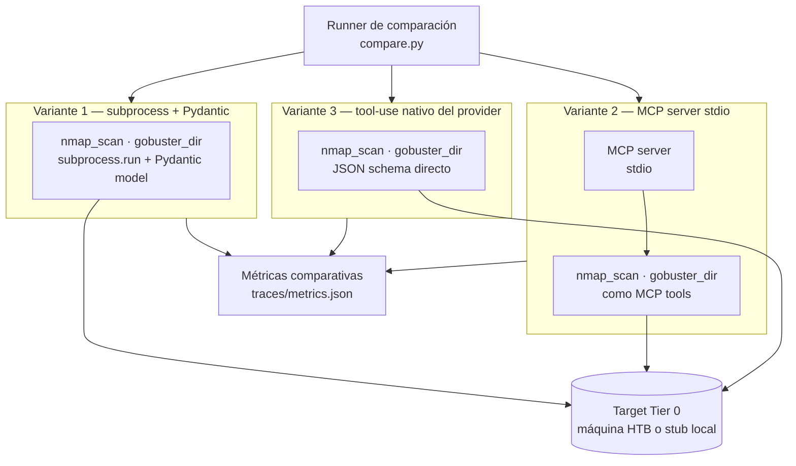

# Product Spec — PoC #5: Contrato de invocación de tools

> [!abstract] Metadata
> | | |
> |---|---|
> | **Status** | 🟢 Completed |
> | **Owner** | Carlos Granden |
> | **Created** | 2026-05-15 |
> | **Updated** | 2026-05-16 |
> | **Version** | v1.0 |
> | **Issue tracking** | [KB #6](https://github.com/apt-404/windmark-knowledge-base/issues/6) |
> | **ADR a decidir** | [ADR-003](https://github.com/apt-404/windmark-knowledge-base/blob/main/specs/mvp/tech-spec.md#adr-003-tools-in-process-con-subprocess-rechazo-de-mcp-en-mvp) |
> | **Bloquea a** | PoC #4 (orquestación) · F0.5 (catálogo de tools Tier 0 del MVP) |

---

## 🎯 Vision

PoC interna en CLI Python que evalúa tres contratos de invocación de tools lado a lado —subprocess+Pydantic, MCP server stdio y tool-use nativo del provider— para decidir cuál adoptar en el MVP de Windmark AI. El output no es una aplicación: es una **decisión arquitectónica trazable** (ADR-003) respaldada por métricas reproducibles.

---

## 🔥 Problem Statement

| Pain | Root Cause |
|------|-----------|
| ADR-003 está marcado como provisional en el tech-spec del MVP, bloqueando PoC #4 y la feature F0.5 (catálogo de tools Tier 0) | Nunca se ha medido el coste real de cada contrato de invocación; la decisión es teórica |
| Se desconoce la fricción de añadir una tool nueva en cada variante | Sin implementación comparada, el coste de mantenimiento es una estimación sin datos |
| Los triggers de upgrade a MCP no tienen condición verificable | Están descritos en el KB de forma cualitativa pero no como criterios concretos y comprobables |

---

## 👤 Target User

- 🎯 **Primary** — Founder técnico (Carlos). Ejecuta la PoC desde CLI, lee los resultados del runner y redacta el `driver.md` con la decisión.

---

## 💎 Design Principles

- **Mínimo viable para decidir** — Sólo se implementa lo que aporta evidencia directa a ADR-003. Cualquier feature que no contribuya a la comparación se rechaza, incluido conectar un LLM real o un orquestador.
- **Paridad estricta entre variantes** — Las tres variantes implementan exactamente las mismas dos tools (`nmap_scan`, `gobuster_dir`) contra el mismo target. Cambiar cualquier otro parámetro entre variantes invalida la comparación.
- **Decisión trazable a evidencia** — El `driver.md` no puede afirmar nada que no esté respaldado por datos del `report.md`. Si hay empate sin ganador claro, se documenta con argumentos y se elige con justificación explícita.
- **Estructura portátil a MCP desde el día 1** — Aunque se elija subprocess+Pydantic, cada tool se escribe como función pura con Pydantic in/out, para que el upgrade a MCP sea ~20 LoC de glue y no una reescritura.

---

## 🏗️ Architecture



- **Runner** (`compare.py`) — Invoca las tres variantes sobre el mismo target con los mismos inputs y recoge métricas por variante. No contiene lógica de tools ni de agente.
- **Variante 1** — Función Python pura por tool; invoca el binario con `subprocess.run()`; input y output tipados en Pydantic; schema generado con `model_json_schema()`. Sin servicios externos.
- **Variante 2** — MCP server local arrancado como proceso stdio; las mismas tools expuestas como MCP tools. El runner actúa como cliente MCP.
- **Variante 3** — Schema de tool-use entregado directamente en JSON al provider (Anthropic / OpenAI). La invocación la gestiona el SDK del provider, sin Pydantic en el path crítico.
- **Target Tier 0** — Máquina HTB Starting Point o stub local suficiente para que `nmap` y `gobuster` devuelvan output real. Sin VPN ni agente en el loop.
- **Métricas** — JSONL por invocación; se consolidan en `traces/metrics.json` al finalizar el runner.


---

## 🛠️ Interfaces

### `compare.py` — Runner de comparación

Ejecuta las tres variantes sobre un target y vuelca métricas comparativas.

| Param | Tipo | Default | Descripción |
|-------|------|---------|-------------|
| `--target` | `str` | ✳️ required | IP o hostname del target Tier 0 |
| `--variant` | `str` | `all` | Ejecutar una variante concreta (`v1`, `v2`, `v3`, `all`) |
| `--tool` | `str` | `all` | Ejecutar una tool concreta (`nmap_scan`, `gobuster_dir`, `all`) |
| `--output` | `str` | `traces/` | Directorio donde volcar JSONL y métricas |

> [!warning] Side effects
> - Lanza tráfico de red real contra el target (nmap, gobuster). Usar un stub local o una máquina HTB autorizada.
> - La variante 2 arranca un proceso MCP server en background; si falla el arranque, la variante se marca como error y el runner continúa con las otras dos.

### Contrato de `nmap_scan`

Tool de reconocimiento de red. Parametrización mínima para demostrar el contrato.

| Param | Tipo | Default | Descripción |
|-------|------|---------|-------------|
| `target` | `str` | ✳️ required | IP o hostname a escanear |
| `ports` | `str` | `"1-1000"` | Rango de puertos |
| `flags` | `list[str]` | `["-Pn", "-sV"]` | Flags adicionales de nmap |

Output esperado: `{ open_ports: [...], service_fingerprints: [...], raw_output: str }`.

### Contrato de `gobuster_dir`

Tool de descubrimiento de rutas web. Parametrización mínima para demostrar el contrato.

| Param | Tipo | Default | Descripción |
|-------|------|---------|-------------|
| `target` | `str` | ✳️ required | URL base del target |
| `wordlist` | `str` | ✳️ required | Ruta al wordlist local |
| `extensions` | `list[str]` | `[]` | Extensiones a añadir al scan |

Output esperado: `{ found_paths: [...], status_codes: {...}, raw_output: str }`.

---

## ⚙️ Configuration

Variables de entorno mínimas para arrancar. Sin LLM real en el loop, no se necesitan API keys.

| Variable | Default | Descripción |
|----------|---------|-------------|
| `TARGET_IP` | — | IP del target Tier 0 (required si no se pasa `--target`) |
| `WORDLIST_PATH` | `/usr/share/wordlists/dirb/common.txt` | Ruta al wordlist para gobuster |
| `MCP_SERVER_TIMEOUT` | `10` | Segundos de espera para que arranque el MCP server (variante 2) |

Mínimo para arrancar: `TARGET_IP` + wordlist accesible + binarios `nmap` y `gobuster` en el PATH.

---

## 🩺 Operations

### Healthcheck

Verificar que el entorno está listo antes de ejecutar el runner:

```
python compare.py --check
```

Comprueba: `nmap` disponible en PATH, `gobuster` disponible en PATH, wordlist accesible, target alcanzable (ping). Devuelve estado por dependencia con código de salida 0 si todo OK, 1 si alguna falla.

### Logging

Cada invocación de tool produce una línea JSONL en `traces/<variant>/<tool>/<timestamp>.jsonl` con: variante, tool, input params, output estructurado, tiempo de ejecución (ms), código de salida del subprocess, y cualquier error. El runner consolida en `traces/metrics.json` al terminar.

---

## 📦 Deliverables

| Deliverable | Descripción |
|:-----------:|-------------|
| 📄 **`tech-spec.md`** | Arquitectura de cada variante, stack y versiones, configuración y pasos para reproducir desde cero |
| 📊 **`report.md`** | Hipótesis evaluadas, métricas comparativas (coste de añadir una tool, latencia, debuggability, ceremonia), hallazgos cualitativos y limitaciones |
| 🏛️ **`driver.md`** | Decisión sobre ADR-003: contrato elegido, evidencia trazable al `report.md`, alternativas descartadas, triggers de upgrade a MCP documentados, riesgos asumidos |
| 🧬 **Código fuente** | Tres directorios de variante con `nmap_scan` y `gobuster_dir`, runner `compare.py` |
| 🔍 **`traces/`** | JSONL por invocación y `metrics.json` consolidado |

---

## 🗂️ Project Structure

> [!abstract]- File tree
> ```
> windmark-poc-5-tools-contract/
> ├── README.md                        # Overview, objetivo, setup WSL y ubicación en roadmap
> ├── AGENTS.md                        # Documentos de referencia del KB para agentes
> ├── compare.py                       # Runner de comparación entre variantes
> ├── Dockerfile                       # Imagen con Python 3.12 + uv + nmap + gobuster
> ├── pyproject.toml                   # Dependencias Python (uv)
> ├── specs/                           # Especificaciones de la PoC
> │   ├── product-spec.md              # Este fichero
> │   ├── tech-spec.md                 # Cómo está implementado cada variante
> │   └── roadmap.md                   # Fases, features y gates de cierre
> ├── outputs/                         # Artefactos generados
> │   ├── report.md                    # Métricas comparativas y hallazgos
> │   ├── report.html                  # Dashboard visual del report
> │   ├── driver.md                    # Decisión final sobre ADR-003
> │   └── variants-clarifications.md  # Aclaración de alcance por variante
> ├── shared/
> │   └── models.py                    # ToolInput y ToolResult compartidos
> ├── variant-1-subprocess/            # Subprocess + Pydantic in-process
> │   ├── nmap_scan.py
> │   └── gobuster_dir.py
> ├── variant-2-mcp-stdio/             # MCP server local por stdio
> │   ├── server.py
> │   └── tools/
> ├── variant-3-native-tooluse/        # Tool-use nativo del provider
> │   └── tools.py
> └── traces/                          # Trazas de invocación end-to-end
>     ├── fixtures/                    # Fixtures LLM pregrabadas (V3)
>     ├── v1/
>     ├── v2/
>     ├── v3/
>     └── metrics.json                 # Consolidado comparativo
> ```

---

## 🚫 Out of Scope

- **LLM real en el loop** — La comparación de contratos no requiere un LLM generando tool calls; el runner invoca las tools directamente. Añadir un LLM mezclaría variables y haría las métricas no comparables.
- **Más de dos tools** — `nmap_scan` y `gobuster_dir` son suficientes para medir la ceremonia de añadir una tool. Más tools aumentan el esfuerzo sin añadir información a la decisión.
- **Targets fuera de Tier 0** — Esta PoC no necesita privesc, web exploitation ni lateral movement. La superficie de las tools es red y discovery.
- **Integración con el orquestador del MVP** — Las variantes son módulos standalone. La integración con el Custom ReAct del MVP la decide ADR-002 (PoC #4), no esta PoC.
- **VPN HTB obligatoria** — Si el target es un stub local (p.ej. un contenedor con nmap y nginx corriendo), la PoC es igualmente válida para medir el contrato.
- **Errores de red o de tool en producción** — El manejo de errores sólo cubre lo necesario para que el runner registre el fallo y siga con la siguiente variante. Sin retry, sin circuit breaker.
- **Tests automatizados** — Esta PoC produce evidencia manual y trazas; la cobertura de tests llega con el MVP.

---

## 🔮 Future

- **Upgrade a MCP cuando llegue el segundo cliente del catálogo** — La estructura de `windmark/tools/` se diseña ya como si fuera un futuro MCP server; portarse cuesta ~20 LoC de glue.
- **Añadir tools Tier 1 al catálogo** — Una vez cerrado ADR-003, el contrato elegido se replica para `gobuster`, `ffuf`, `sqlmap`, `hydra`, `msfconsole` en la feature F1.1–F1.4 del MVP.
- **Runner reutilizable como benchmark de tools** — Si en el MVP se necesita comparar implementaciones de tools nuevas, `compare.py` puede evolucionar a un harness de benchmarking.

---

## ❓ Discovery

- [x] ~~Triggers exactos de migración a MCP~~ → Documentados en `outputs/driver.md`: (1) segundo cliente independiente del catálogo, (2) tool con blast radius que requiere aislamiento de contenedor, (3) demanda explícita de protocolo MCP por cliente externo. Criterios verificables y condiciones negativas cerradas.
- [x] ~~Número de variantes~~ → Tres variantes en paralelo con runner de comparación
- [x] ~~Alcance de tools~~ → `nmap_scan` y `gobuster_dir` sobre Tier 0, sin LLM en el loop
- [x] ~~LLM en el loop~~ → Excluido del scope; el runner invoca las tools directamente
- [x] ~~Orquestador en el scope~~ → Excluido; la integración es responsabilidad de PoC #4
