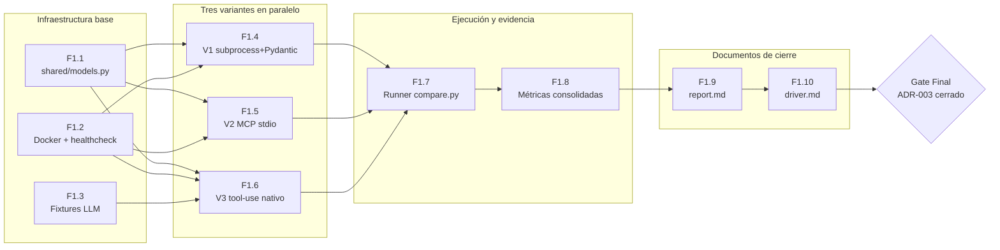
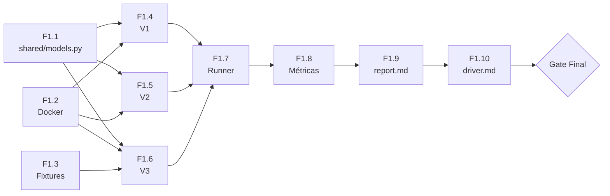

> [!abstract] Metadata
> | | |
> |---|---|
> | **Status** | 🟡 Draft |
> | **Owner** | Carlos Granden |
> | **Created** | 2026-05-16 |
> | **Updated** | 2026-05-16 |
> | **Version** | v0.1 |
> | **Parent specs** | [[product-spec]] · [[tech-spec]] |
> | **Scope** | Una sola fase de features; sin PoCs internas (este repo es la PoC) |

---

## 🔗 Tracking

| Item | Issue |
|---|---|
| PoC #5 — Contrato de invocación de tools (parent) | [#6](https://github.com/apt-404/windmark-knowledge-base/issues/6) |
| F1.1 — Contrato de datos compartido | [#10](https://github.com/apt-404/windmark-knowledge-base/issues/10) |
| F1.2 — Entorno Docker + healthcheck | [#11](https://github.com/apt-404/windmark-knowledge-base/issues/11) |
| F1.3 — Fixtures LLM pregrabadas | [#12](https://github.com/apt-404/windmark-knowledge-base/issues/12) |
| F1.4 — Variante 1: subprocess + Pydantic | [#13](https://github.com/apt-404/windmark-knowledge-base/issues/13) |
| F1.5 — Variante 2: MCP server stdio | [#14](https://github.com/apt-404/windmark-knowledge-base/issues/14) |
| F1.6 — Variante 3: tool-use nativo del provider | [#15](https://github.com/apt-404/windmark-knowledge-base/issues/15) |
| F1.7 — Runner de comparación | [#16](https://github.com/apt-404/windmark-knowledge-base/issues/16) |
| F1.8 — Ejecución y métricas consolidadas | [#17](https://github.com/apt-404/windmark-knowledge-base/issues/17) |
| F1.9 — Reporte comparativo | [#18](https://github.com/apt-404/windmark-knowledge-base/issues/18) |
| F1.10 — Decisión ADR-003 | [#19](https://github.com/apt-404/windmark-knowledge-base/issues/19) |

---

## 🎯 Vision

Este roadmap cubre la ejecución completa de la PoC #5: desde la infraestructura base (contrato de datos, entorno Docker) hasta el artefacto decisional final (`driver.md` con ADR-003 cerrado). Las diez features se agrupan en una sola fase sin sub-tiers, ordenadas por dependencia natural: primero el contrato compartido y el entorno, luego las tres variantes en paralelo, después el runner que las integra, y finalmente la ejecución, el reporte y la decisión.

---

## 📊 Overview

---

## 🚀 Phase 1 — Implementación y decisión

Esta fase cubre el ciclo completo de la PoC: infraestructura base, implementación de las tres variantes, runner de comparación, ejecución contra el target Tier 0, reporte de métricas y decisión arquitectónica sobre ADR-003. No hay sub-tiers; el orden lo imponen las dependencias.

| # | Feature | Depende de | Notas |
|---|---|---|---|
| F1.1 | Contrato de datos compartido (`shared/models.py`) | — | `ToolInput` y `ToolResult` Pydantic; única fuente de verdad del contrato de datos |
| F1.2 | Entorno Docker + healthcheck | — | Imagen Debian/Kali con Python 3.12, uv, nmap, gobuster; `compare.py --check` |
| F1.3 | Fixtures LLM pregrabadas (`traces/fixtures/`) | — | Operación manual con `claude` CLI previa al primer run; bloquea solo V3 |
| F1.4 | Variante 1: subprocess + Pydantic (`variant-1-subprocess/`) | F1.1, F1.2 | Hipótesis de partida de ADR-003; funciones puras con `subprocess.run()` |
| F1.5 | Variante 2: MCP server stdio (`variant-2-mcp-stdio/`) | F1.1, F1.2 | FastMCP con `@mcp.tool()`; arrancado como subproceso por el runner |
| F1.6 | Variante 3: tool-use nativo (`variant-3-native-tooluse/`) | F1.1, F1.2, F1.3 | Schema OpenAI tools[]; LLM mockeado con fixture pregrabada |
| F1.7 | Runner de comparación (`compare.py`) | F1.4, F1.5, F1.6 | CLI con `--target`, `--variant`, `--tool`, `--output`; consolida JSONL |
| F1.8 | Ejecución y métricas consolidadas (`traces/metrics.json`) | F1.7 | Run completo contra target Tier 0 real; `metrics.json` con datos por variante |
| F1.9 | Reporte comparativo (`outputs/report.md`) | F1.8 | Hipótesis, métricas, hallazgos cualitativos y limitaciones; trazable a `metrics.json` |
| F1.10 | Decisión ADR-003 (`outputs/driver.md`) | F1.9 | Contrato elegido, evidencia trazable, triggers MCP verificables, riesgos asumidos |

**Criterio de cierre Fase 1** — `outputs/driver.md` completo con ADR-003 cerrado (contrato elegido con evidencia trazable al `report.md`) y los tres triggers de upgrade a MCP documentados como criterios verificables, no cualitativos.

---

## 🔗 Dependency Graph

F1.1 y F1.2 son independientes entre sí y pueden arrancarse en paralelo. F1.3 también es independiente pero solo bloquea F1.6. Las variantes F1.4, F1.5 y F1.6 pueden desarrollarse en paralelo una vez cerradas sus dependencias. F1.7 requiere las tres variantes funcionales.

---

## ✅ Gates

### Gate Final — PoC #5 cerrada

Condiciones que deben cumplirse simultáneamente para considerar la PoC terminada y ADR-003 decidido:

- `compare.py --check` devuelve código de salida 0 en el contenedor Docker
- `compare.py --variant all --tool all` completa sin que todas las variantes fallen (código de salida 0)
- `traces/metrics.json` contiene métricas de al menos dos variantes con `duration_ms` y `exit_code` por invocación
- `outputs/report.md` incluye una tabla comparativa con coste de añadir una tool nueva, latencia media y debuggability por variante
- `outputs/driver.md` declara el contrato elegido con referencia explícita a sección del `report.md`
- `outputs/driver.md` cierra los tres triggers de upgrade a MCP como criterios verificables (no cualitativos): qué cuenta como segundo cliente, qué blast radius justifica un container separado, qué demanda comercial obliga a MCP

---

## 🚫 Out of Roadmap

- **LLM real en el loop** — Añadir un LLM generando tool calls mezcla variables y hace las métricas no comparables. Excluido del scope de esta PoC.
- **Más de dos tools** — `nmap_scan` y `gobuster_dir` son suficientes para medir la ceremonia de añadir una tool. Más tools no añaden información a la decisión.
- **Targets fuera de Tier 0** — Privesc, web exploitation y lateral movement quedan fuera. La superficie de esta PoC es red y discovery.
- **Integración con el orquestador del MVP** — Responsabilidad de PoC #4 (Custom ReAct). Esta PoC entrega el contrato de invocación, no la integración con el orquestador.
- **VPN HTB obligatoria** — Un stub local (contenedor con nmap y nginx) es válido para medir el contrato.
- **Manejo de errores de producción** — Sin retry, sin circuit breaker. El runner registra el fallo y continúa.
- **Tests automatizados** — La cobertura de tests llega con el MVP. Esta PoC produce evidencia manual y trazas.
- **Upgrade a MCP (futuro)** — El diseño de `windmark/tools/` se estructura ya como futuro MCP server; el upgrade cuesta ~20 LoC de glue. Fuera del alcance de esta PoC.
- **Tools Tier 1** — `gobuster`, `ffuf`, `sqlmap`, `hydra`, `msfconsole` se añaden en las features F1.1-F1.4 del MVP una vez cerrado ADR-003.
- **Runner como benchmark reutilizable** — `compare.py` podría evolucionar a un harness de benchmarking de tools en el MVP. Fuera del scope actual.
